## My Python Learning Journey 

Hi! I’m Inderpreet Kaur, a BSc Mathematics graduate and aspiring Data Scientist mastering Python, NumPy, and ML. This repo holds my hands-on learning journey, with all files created as Jupyter notebooks (.ipynb). Explore my progress from basics to projects like TicTacToe, and feel free to fork or collaborate!

## Features

Comprehensive Topics: Covers basics (variables, loops), data structures (lists, dictionaries), functions, exceptions, classes, file handling, and more.
Interactive Learning: All content in Jupyter notebooks for easy execution and experimentation.
Project Highlights: Includes a playable TicTacToe game and creative pattern designs.
Beginner-Friendly: Step-by-step notebooks with clear explanations for learners like me.

##Project Structure

learning--python/
├── Tic_Tac_Toe_game.ipynb           #project of game tic_tac_toe  
├── 01_numbers_and_variables.ipynb    # Basics: Variables & math  
├── 02_string.ipynb                  # Basics: String manipulation  
├── 03_input_and_prints.ipynb        # Basics: Input/output   
├── 04_if_&_else.ipynb               # Basics: Conditionals  
├── 05_tuples.ipynb                  # Data structures  
├── 06_list.ipynb                    # Data structures  
├── 07_dictionary.ipynb              # Data structures  
├── 08_sets.ipynb                    # Data structures   
├── 09_whileLoop.ipynb               # Loops   
├── 10_while_questions.ipynb         # Loop challenges  
├── 11_patterns.ipynb                # Creative patterns  
├── 12_api.ipynb                     # API exploration   
├── 13_for_loop.ipynb                # Loops   
├── 14_import.ipynb                  # Functions   
├── 15_functions.ipynb               # Functions & exceptions     
├── 16_try_except.ipynb              # Functions & exceptions    
├── 17_Recursion.ipynb               # Advanced: Recursion    
├── 18_Class.ipynb                   # Advanced: Classes    
├── 19_file_handling.ipynb           # Advanced: File handling    
├── customer.txt                     # Data: Customer info    
├── netmax.txt                       # Data: Netmax notes    
├── nested_whileLoop.ipynb           # Advanced: Nested loops    
├── README.md                        # This file!   

## Visual Highlights

Explore some outputs from my Jupyter notebooks:
from patterns:

  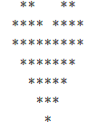
  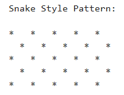
  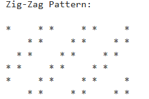

  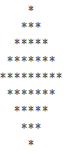
  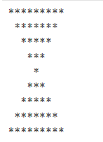
  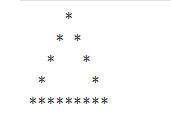

From tic_tac_toe_game:

  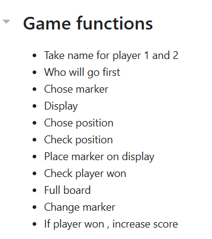
  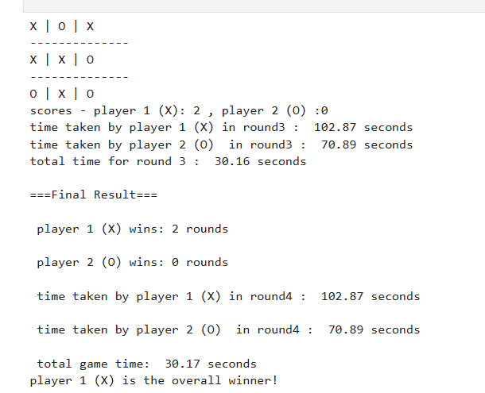
  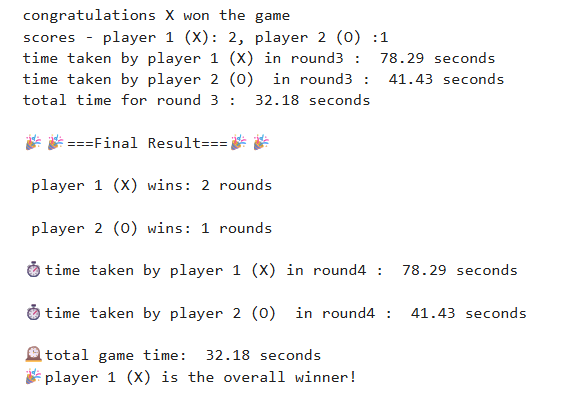

From if-else:

  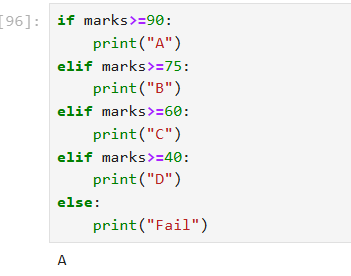
  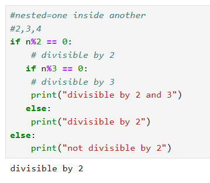
  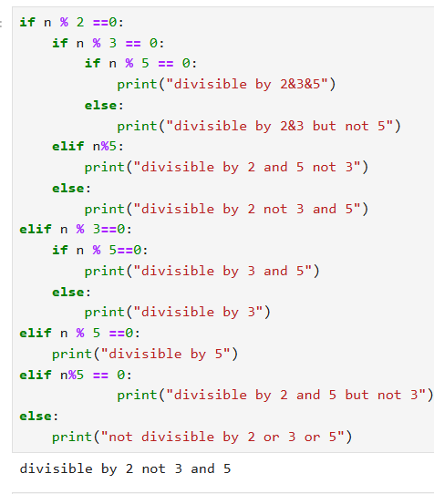

From if-else:

  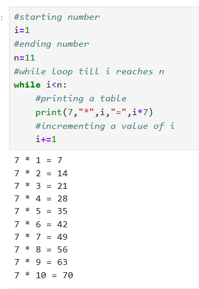
  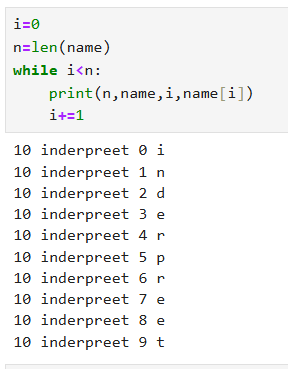
  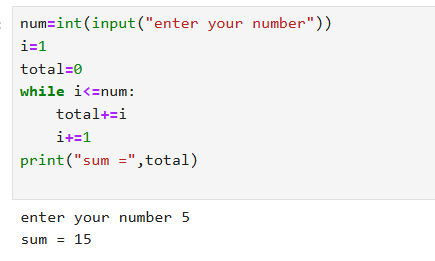

Note: Click images to view full size on GitHub. More screenshots coming as I add projects!
## Learning Outcomes
Gained a solid foundation in Python syntax, loops, and conditionals.  
Mastered data structures like lists, tuples, sets, and dictionaries.   
Developed skills in functions, exception handling, and recursion.   
Explored object-oriented programming with classes.   
Built practical projects like TicTacToe and pattern designs.   
Learned file handling and basic API interactions     

## Requirements
Python: Version 3.8 or higher.
Jupyter Notebook: Install via pip install jupyter or use an online platform like Google Colab.
Libraries: Built-in Python libraries used (no external dependencies for core files).
Setup: Clone the repo with git clone https://github.com/inderpreet0649/learning--python.git, then run jupyter notebook in your terminal.

## License

This project is licensed under the MIT License - see the LICENSE file for details. Feel free to use, modify, and share my code!

## Contact
GitHub: https://github.com/inderpreet0649   
LinkedIn: https://www.linkedin.com/in/inderpreet-kaur-613b1437b/ (Connect for collabs!)    
Email: inderpreetkaur0649@gmail.com (For questions or feedback)    

Star ⭐ this repo if it helps you! Open an issue for suggestions—I’m excited to learn and grow together. Updated with ❤️ in 2025.